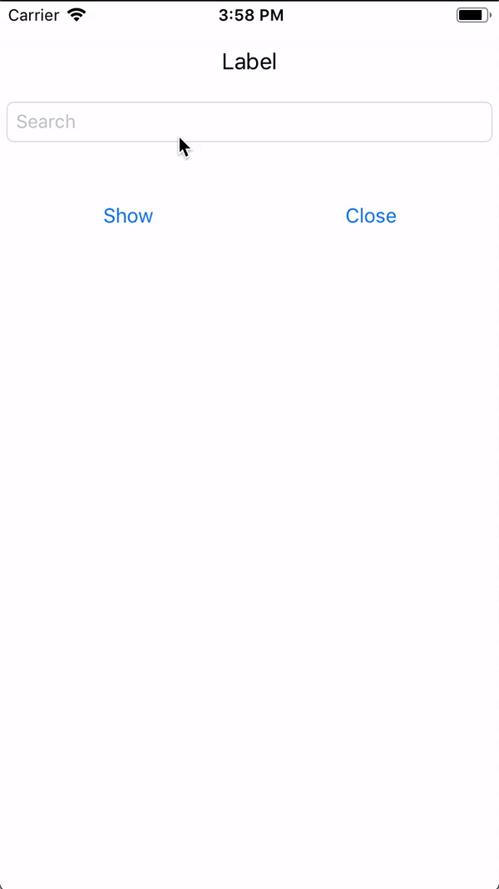

# Drop Down

In summary, it helps you choose from the list in swift.
Mydropdown library is similar to skyscanner app. For example , it's like country search part.

# Preview

| SkyScanner | myDropDown |
| ------ | ------ |
|  |  |

## Manually
  1. Download and drop ```myDropDownController.swift``` in your project.  
  2. Congratulations!  

## Basic Usage 

This simplest usage.

```swift
 let dropDownVC            = myDropDownController()
 dropDownVC.yourTextField = demoTextField 
 dropDownVC.yourList      = ["Trail Version","Hey","Apple0","Apple1","Las Vegas","Last","Arr","Rr"]
 dropDownVC.yourView      = self.view
 dropDownVC.create()
```

## Properties

Create method have two parameters. These are position and position auto. It's features set dropDown position automatic or manually.

```swift
dropDownVC.create(position: .top,positonAuto: false)
```

returns the selected items (```listName and index ``` )

```swift
dropDownVC.didSelect { (listName, index) in
self.demoTextField.text = listName
print(listName)
print(index)
self.didSelectName.text = listName + " - Index: \(index)"
}
```

You want only get filter list. You can use this closure.

```swift
// For example  textfield your text "arr"
dropDownVC.filterList { (filterList) in
print(filterList) // ["Array","Arr"]
}
```


if you want , you can always keep the pop-up open.

```swift
dropDownVC.alwaysOpen = true
```

**Other closures**

Follow dropDown part with this closures

```swift
dropDownVC.willOpen {
print("will Show")
}
 
dropDownVC.didLoad {
print("did Load")
}

dropDownVC.didClose {
print("Did Close")
}
```


```Non optional feature```

it gets first element in the array if the content does not match

## Configure 

```swift    
public var borderColor:String                               = "f5f5f5"
public var borderWidth:CGFloat                              = 1.0
public var cornerRadius:CGFloat                             = 10
public var dropDownHeight:CGFloat                           = 140
public var dropDownStatus:dropDownHeightStatus              = .auto
public var dropDownAnimation:UIViewAnimationOptions         = [.curveEaseInOut]
public var backgroundColor:String                           = "#000000"
public var backgroundAlpha:CGFloat                          = 0.7    
```

## Release History

- 1.0.0 - Test version

# MIT License

```Copyright (c) 2018 Batuhan Saygılı```

Permission is hereby granted, free of charge, to any person obtaining a copy of this software and associated documentation files (the "Software"), to deal in the Software without restriction, including without limitation the rights to use, copy, modify, merge, publish, distribute, sublicense, and/or sell copies of the Software, and to permit persons to whom the Software is furnished to do so, subject to the following conditions:

The above copyright notice and this permission notice shall be included in all copies or substantial portions of the Software.

THE SOFTWARE IS PROVIDED "AS IS", WITHOUT WARRANTY OF ANY KIND, EXPRESS OR IMPLIED, INCLUDING BUT NOT LIMITED TO THE WARRANTIES OF MERCHANTABILITY, FITNESS FOR A PARTICULAR PURPOSE AND NONINFRINGEMENT. IN NO EVENT SHALL THE AUTHORS OR COPYRIGHT HOLDERS BE LIABLE FOR ANY CLAIM, DAMAGES OR OTHER LIABILITY, WHETHER IN AN ACTION OF CONTRACT, TORT OR OTHERWISE, ARISING FROM, OUT OF OR IN CONNECTION WITH THE SOFTWARE OR THE USE OR OTHER DEALINGS IN THE SOFTWARE.
