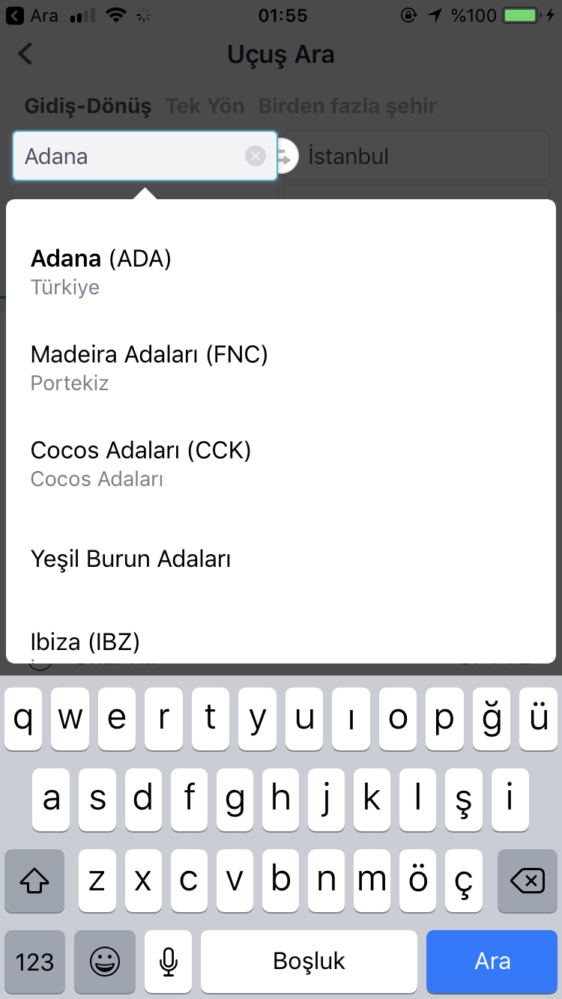

# Drop Down

In summary, it helps you choose from the list in swift.
Mydropdown library is similar to skyscanner app. For example , it's like country search part.

# Preview

| SkyScanner | myDropDown |
| ------ | ------ |
|  |  |

## Manually
  1. Download and drop ```myDropDownController.swift``` in your project.  
  2. Congratulations!  

## Basic Usage 

This simplest usage.

```swift
 let dropDownVC            = myDropDownController()
 dropDownVC.yourTextField = demoTextField 
 dropDownVC.yourList      = ["Array","Deneme","Hey","Apple0","Apple1","Las Vegas","Last","Arr","Rr"]
 dropDownVC.yourView      = self.view
 dropDownVC.create()
```

## Properties

Create method have two parameters. These are position and position auto. It's features set dropDown position automatic or manually.

```swift
dropDownVC.create(position: .top,positonAuto: false)
```

returns the selected items (```list name and index ``` )

```swift
dropDownVC.didSelect { (listName, index) in
self.demoTextField.text = listName
print(listName)
print(index)
self.didSelectName.text = listName + " - Index: \(index)"
}
```

You want only get filter list. You can use this closure.

```swift
// For example  textfield your text "arr"
dropDownVC.filterList { (filterList) in
print(filterList) // ["Array","Arr"]
}
```


if you want , you can always keep the pop-up open.

```swift
dropDownVC.alwaysOpen = true
```

**Other closures**

Follow dropDown part with this closures

```swift
dropDownVC.willDidOpen {
print("will Did Show")
}
 
dropDownVC.didLoad {
print("did Load")
}

dropDownVC.willDidClosed {
print("will Did Closed")
}
```


```Non optional feature```

it gets first element in the array if the content does not match

## Configure 

```swift    
public var borderColor:String                               = "f5f5f5"
public var borderWidth:CGFloat                              = 1.0
public var cornerRadius:CGFloat                             = 10
public var dropDownHeight:CGFloat                           = 140
public var dropDownStatus:dropDownHeightStatus              = .auto
public var dropDownAnimation:UIViewAnimationOptions         = [.curveEaseInOut]
public var backgroundColor:String                           = "#000000"
public var backgroundAlpha:CGFloat                          = 0.7    
```

## Release History

- 1.0.0 - Test version
